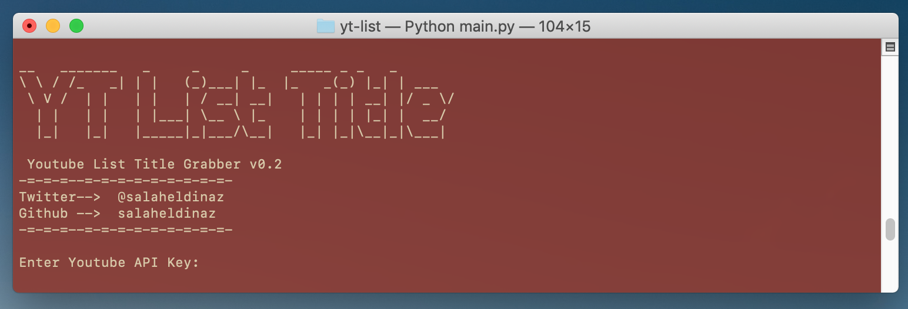
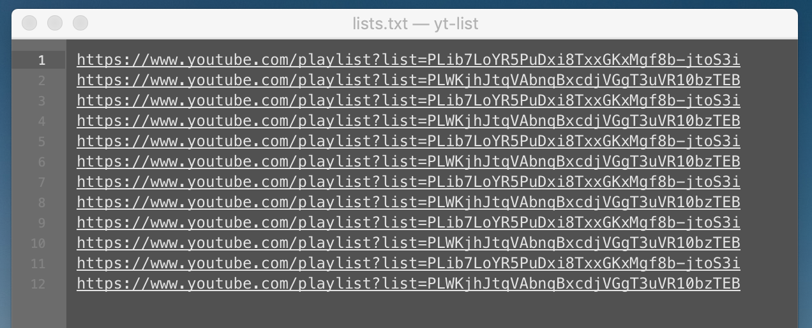
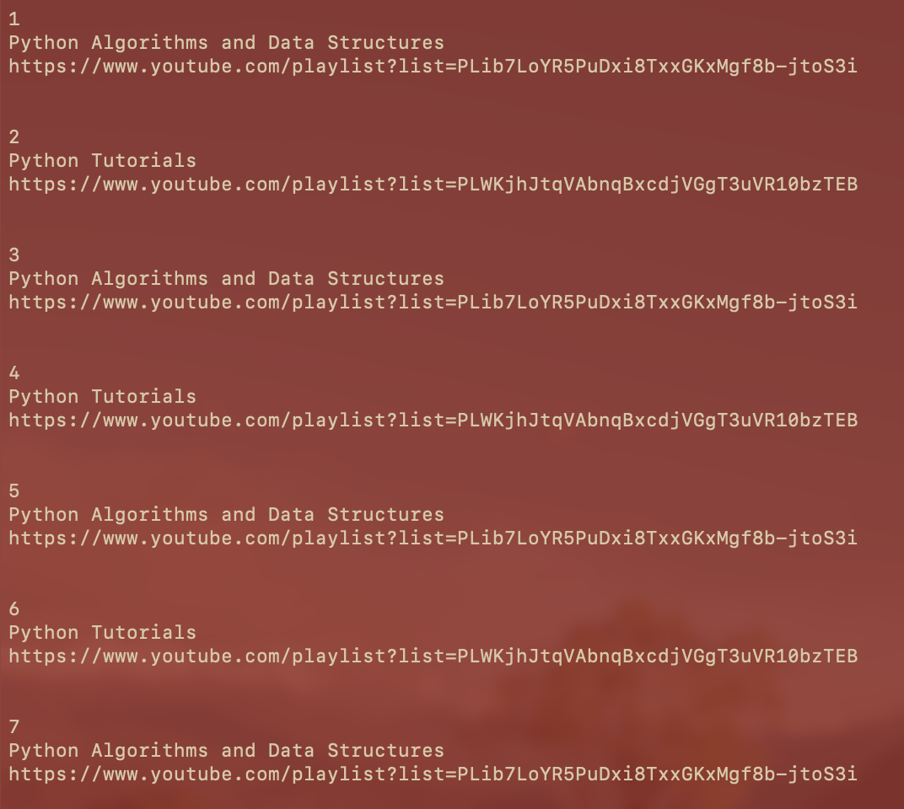
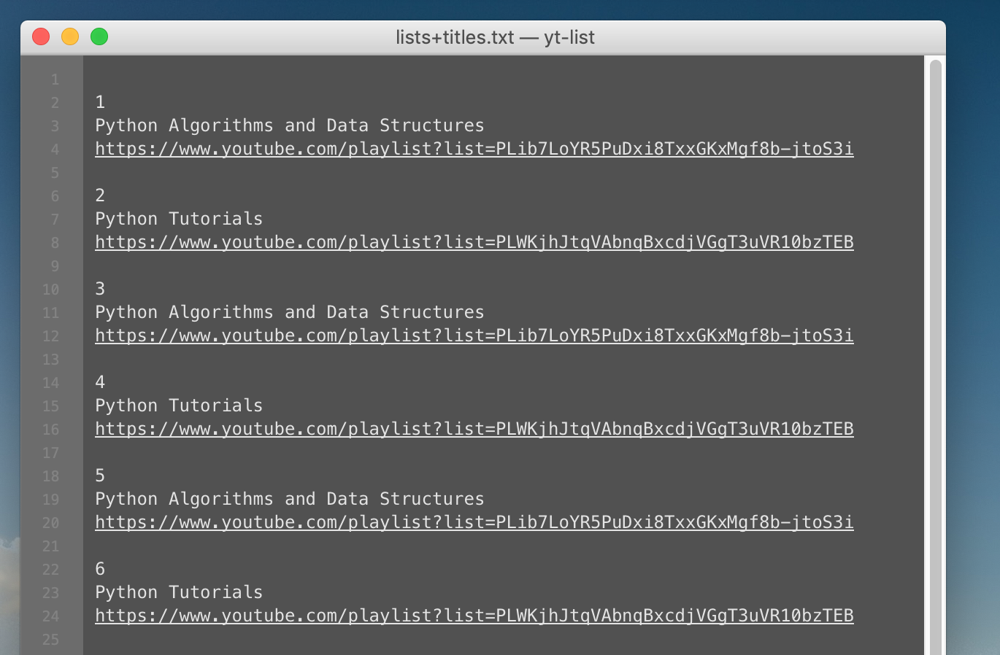

# Youtube Lists Title Grabber 
>version v0.2

Youtube lists title grabber written in Python using Youtube API v3.

_I had a long list of urls for Youtube lists without title for each list._


> 


## Prerequisite
- Python 3.5+
- Python modules:
   - simplejson
   - requests
   
To install required modules :
```shell
pip3 install -r requirements.txt
```

## Usage
1. Grab your `API key` from this link:  
    [Google Developers Console](https://console.developers.google.com/apis/credentials?supportedpurview=project)

2. Edit [lists.txt]() with your Youtube lists urls as shown
    > 

3. Run `main.py` :

    ```shell
    python3 main.py
    ```
    > 
    
    >    
4. Open [lists+titles.txt]() to see the results:
    > 


## Todo list
- Add more option to select data from api
- Add more detailed error messages
- Filter DNS records to just records accept ip as value

## External Resources
> [YouTube API documentation](https://developers.google.com/youtube/) 

